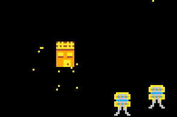

# god_game
 Work in progress - a god game / RTS type thing using Pyxel
 
 ## What is it?
 
 My favourite games when I was younger were always RTS e.g. Populous: The Beginning, Age of Empires... so I wanted to have a go at recreating some of the mechanics of a game of this genre. At the moment the game has no real objective, but the following features are in place:
 
 
 
 1. Select a group of followers to move location
 
 
 
 2. Build a mine on top of some ore
 3. Send followers to mine the ore
 
 
 
 4. Build a generator to generate energy 
 
 

 5. Build a barracks to train soldiers
 
 
 
 6. Build a factory to create tanks
 
 
 
 7. Scroll around the map
 
 8. Listen to the randomly generated chiptune soundtrack
